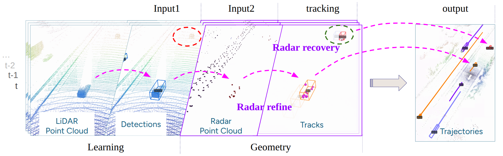
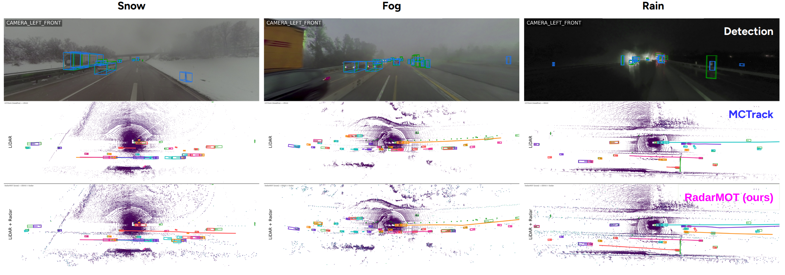

RadarMOT: Radar-Informed 3D Multi-Object Tracking under Adverse Conditions
---

[](https://arxiv.org/abs/2604.13571)
[](https://bingxue-xu.github.io/RadarMOT)
[](https://drive.google.com/file/d/1kdWUai6_KiSi3-Abp_2aLyY9dkRWXolZ/view?usp=sharing)

TL;DR: We address real-world adverse environmental challenges in 3D multi-object tracking: incorporating radar as explicit physical **observation** in tracking stage and recover tracks when detections are missed. Our RadarMOT efficiently captures moving objects cues, , compatible with any detector **without retraining**.  🚀

<!--  -->
<p align="center">
  
</p>


## Results on MAN-TruckScenes Val Set
We compare our method with baselines on the MAN-TruckScenes validation set under the same settings, and provide detailed metric summaries, including range bins, classes, and full results for 34 scene tags, in the metrics_summary JSON files.

### Main performance
| Method | Detector | AMOTA%&nbsp;↑ | TP&nbsp;↑ | FP&nbsp;↓ | FN&nbsp;↓ | IDS&nbsp;↓ | Results |
| :---: | :---: | :---: | :---: | :---: | :---: | :---: | :---: |
| CenterPoint | CenterPoint | 22.8 | 37149 | **8467** | 26912 | 7278 | [metrics_summary.json](results/pubtracker_metrics_summary.json) |
| MCTrack | CenterPoint | 26.6 | 33636 | 13026 | 32378 | 5325 | [metrics_summary.json](results/mctrack_metrics_summary.json) |
| **RadarMOT (ours)** | CenterPoint | **33.3** | **42717** | 12257 | **24906** | **3716** | [metrics_summary.json](results/radarmot_metrics_summary.json) |

### Robustness

Range consistency comparison across ranges. 

| Method | Detector | Overall<br>AMOTA% ↑ / IDS ↓ | 0–50 m<br>AMOTA% ↑ / IDS ↓ | 50–100 m<br>AMOTA% ↑ / IDS ↓ | 100–150 m<br>AMOTA% ↑ / IDS ↓ |
| :---: | :---: | :---: | :---: | :---: | :---: |
| CenterPoint | CenterPoint† | 22.8 / 7278 | 28.1 / 2766 | 21.5 / 3107 | 21.2 / 1518 |
| MCTrack | CenterPoint† | 26.6 / 5325 | 30.8 / 1804 | 23.8 / 1704 | 20.1 / **836** |
| **RadarMOT (ours)** | CenterPoint† | **33.3** / **3716** | **36.0** / **1321** | **32.2** / **1451** | **32.8** / 895 |


### Visualization

<p align="center">
  
</p>

Images with detections (blue) vs ground truth (green) of 3D object detection are displayed for context.


## Cite & Acknowledgements
```
@misc{xu2026radarinformed3dmultiobjecttracking,
      title={Radar-Informed 3D Multi-Object Tracking under Adverse Conditions}, 
      author={Bingxue Xu and Emil Hedemalm and Ajinkya Khoche and Patric Jensfelt},
      year={2026},
      eprint={2604.13571},
      archivePrefix={arXiv},
      primaryClass={cs.CV},
      url={https://arxiv.org/abs/2604.13571}, 
}
```
We thank these great works and open-source codebases:

* 3D Detection. [MMDetection3d](https://github.com/open-mmlab/mmdetection3d), [CenterPoint](https://github.com/tianweiy/CenterPoint)
* Multi-object tracking. [MCTrack](https://github.com/megvii-research/MCTrack), [CenterPoint](https://github.com/tianweiy/CenterPoint)
* Dataset. [MAN-TruckScenes](https://github.com/TUMFTM/truckscenes-devkit)
